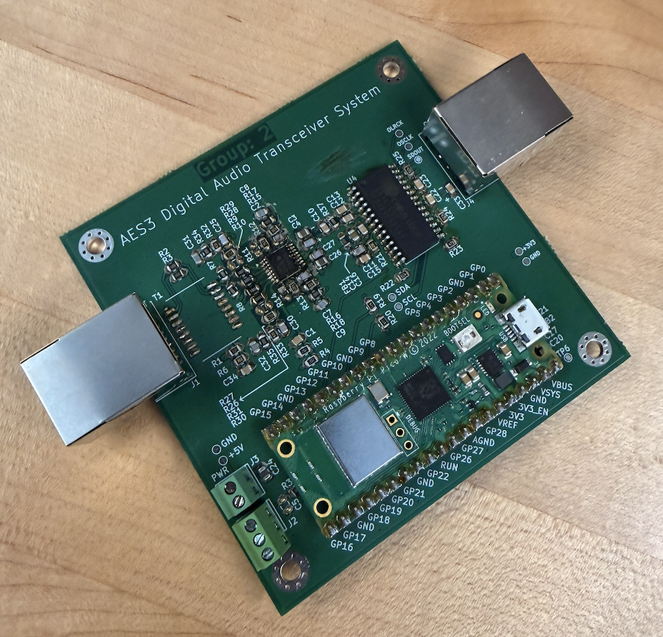
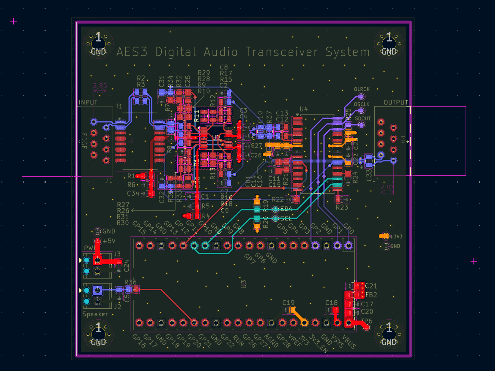
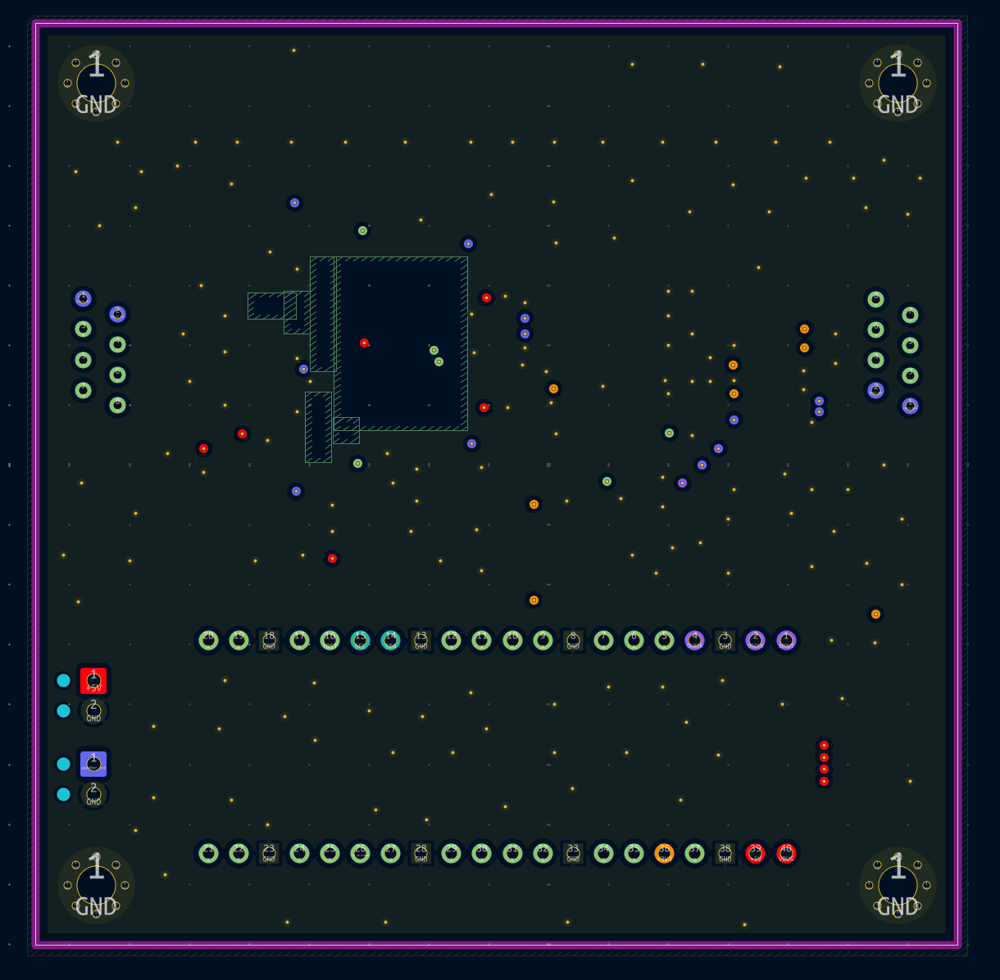
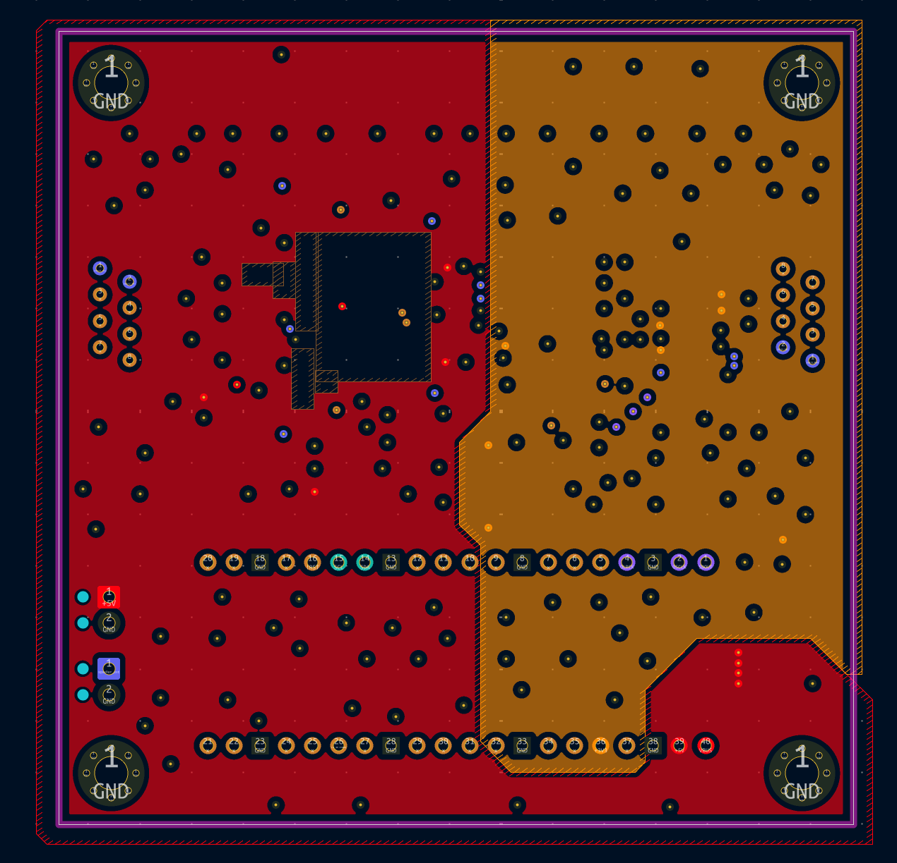
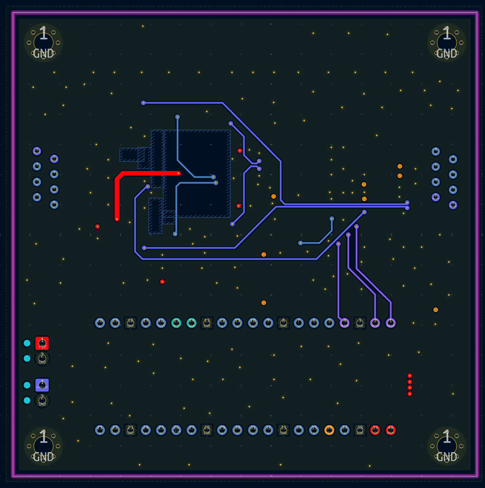

# AES3 Digital Audio Transceiver

> A mixed-signal PCB implementing a complete AES3 digital audio transceiver — designed for use as a standalone node or daisy-chained across long cable runs for distributed speaker systems. Board manufactured, assembly and bringup in progress.


---


## Overview

AES3/SPIDF is the professional standard for digital audio transmission over balanced lines — built for reliability over long cable runs in live sound and broadcast environments. This board implements a full transceiver: it receives an AES3 signal, decodes it to I2S, processes it via a Raspberry Pi Pico, and re-encodes and drives a new AES3 output. Daisy-chaining multiple boards allows a single audio source to be distributed across hundreds of meters with appropriate delay compensation at each node — a common requirement in large venue speaker systems.

The primary design challenge was mixed-signal partitioning: keeping the analog front-end and output driver stages clean while sharing a board with a digital microcontroller.

---



---

## Hardware Features

| Subsystem | Detail |
|---|---|
| **AES3 Input** | Transformer-coupled differential input via PE65723NL-T2, RJ45 connector |
| **Input front-end** | TI THS4522 high-speed fully differential amplifier — level shifts 2.5V (DE) → 3.3V (DE), VOCM biased at 1.65V |
| **AES3 Receiver** | Cirrus Logic CS8416 — decodes AES3 to I2S (SDOUT, OSCLK, OLRCK), I2C configurable |
| **Controller** | Raspberry Pi Pico — I2C control of CS8416, audio processing, speaker output |
| **AES3 Output driver** | THS4522 fully differential amplifier — level shifts 3.3V (SE) → 5V (DE), VOCM biased at 2.5V |
| **AES3 Output** | Differential output, RJ45 connector |
| **Power** | USB or external 5V screw terminal input; onboard 3.3V regulated supply from Pico; ferrite-filtered 3V3A analog rail |

---

## Signal Chain

```
AES3 Input (RJ45)
  → PE65723NL-T2 transformer (isolation + CMR)
  → THS4522 differential amp (2.5V → 3.3V level shift)
  → CS8416 AES3 receiver (AES3 → I2S)
  → Raspberry Pi Pico (I2C control + processing)
  → THS4522 differential amp (3.3V → 5V level shift)
  → PE65723NL-T2 transformer
  → AES3 Output (RJ45)
```

---

## PCB Design

4-layer stackup. The primary design consideration was analog/digital partitioning — the THS4522 input and output stages, transformer coupling, and VOCM reference networks are physically separated from the digital section (Pico, CS8416, I2C lines).

Key decisions:
- Separate analog (3V3A) and digital (3V3) supply domains, bridged by a 2200Ω @ 100MHz ferrite bead
- Copper cutout on L2 & L3 beneath both THS4522 op-amps — no power plane under the input pins to reduce parasitic capacitive coupling into the differential nodes
- Stitching vias around the board perimeter and between analog/digital sections tie L1/L4 copper pours to the L2 ground plane, with transfer vias placed at every signal layer transition to maintain return current continuity
- DNP resistors on transformer bypass paths and op-amp feedback networks allow gain adjustment or transformer bypass at assembly without a respin

<table>
  <tr>
    <td align="center"><br/><sub>L1</sub></td>
    <td align="center"><br/><sub>L2 - GND</sub></td>
  </tr>
  <tr>
    <td align="center"><br/><sub>L3 - Segmented Power Plane</sub></td>
    <td align="center"><br/><sub>L4</sub></td>
  </tr>
</table>

---

## Schematic Structure

| Block | Key content |
|---|---|
| AES3 Differential Input Front-End | PE65723NL-T2 transformer, THS4522 input amp, VOCM1 (1.65V) bias network, input filtering |
| Digital Audio Receiver (AES3 → I2S) | CS8416, ferrite-filtered 3V3A supply, I2C address config, Tx_Pass signal to output stage |
| AES3 Differential Output Driver | THS4522 output amp, VOCM2 (2.5V) bias network, output filtering, RJ45 output |
| Raspberry Pi Pico | I2S input (SDOUT/OSCLK/OLRCK), I2C to CS8416, USB + external 5V power input |

---

## Status & Next Steps

- [x] Schematic complete
- [x] PCB layout complete
- [x] Board manufactured
- [x] Assembly
- [x] Bringup — supply rails, CS8416 I2C comms, AES3 signal integrity
- [ ] Firmware — Pico I2C config, audio processing, delay compensation
- [ ] Daisy-chain validation

---

## Tools

| Tool | Purpose |
|---|---|
| KiCad | Schematic capture and PCB layout |
| Raspberry Pi Pico SDK | Firmware development |
| CS8416 datasheet | AES3 receiver configuration |
| THS4522 datasheet | Differential amplifier gain and VOCM network design |
| AES3 / AES-EBU standard | Protocol reference |

---

## Author

**John Alexander** — course project, SFU School of Mechatronic Systems Engineering, MSE 491 Advanced Electronic Circuits.
